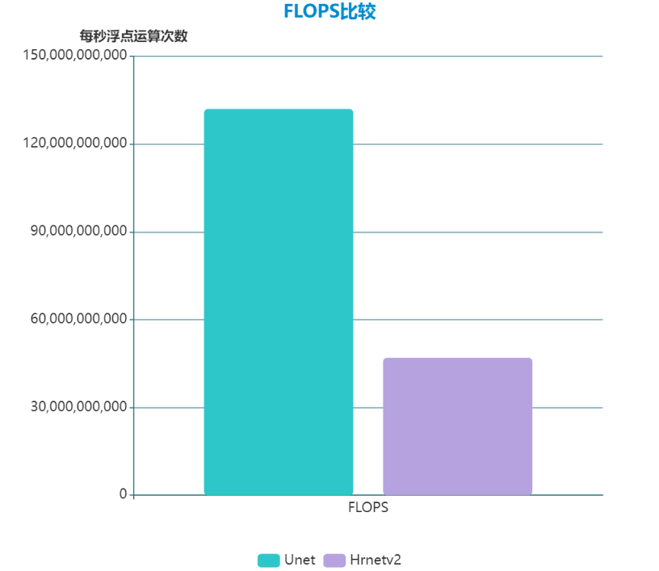
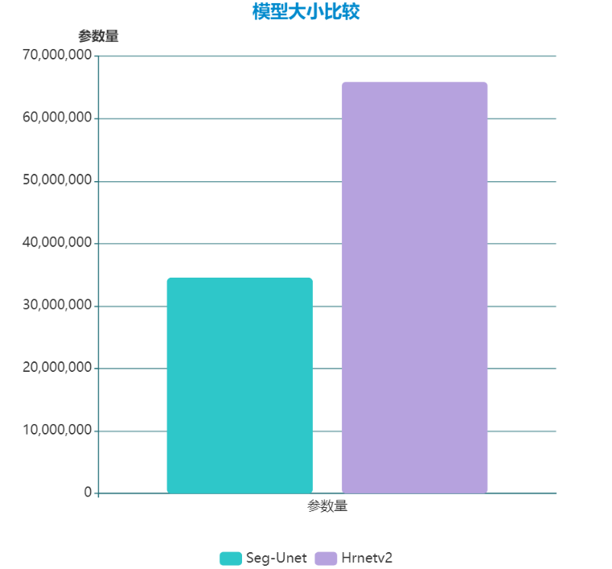

# 结合Intel OneAPI 在自动驾驶场景下应用语义分割模型
本项目为 SCUT 智能计算团队在2023夏季英特尔oneAPI校园黑客松竞赛的参赛作品(赛题一)
## 目录 
 - 项目介绍 [Introduction to Project](#purpose)
 - 模型选择[Choice Of Model](#reference-solution)
 - 英特尔®优化实现方式 [Intel® Optimized Implementation](#Intel-implementation)
 - 结果展示 [Performance Observations](#performance-observations)
 - 代码说明 [Code Explanation](#code_explanation)
 - 心得收获 [What we learn](#whatwelearn)
 - 参考 [Reference](#reference)
<a id="purpose"></a>
## Introduction to Project
| 项目介绍   
  - **场景介绍**  
    自动驾驶汽车正在改变人们的生活、工作以及娱乐方式，创造出一种更安全、更高效的道路运输方式。这些革命性优势需要基于高效准确的模型以及其背后所需的大量算力。
    而作为自动驾驶系统中的一项重要核心技术——图像语义分割，不仅在工业界的需求日益凸显，同时语义分割也是当下学术界的研究热点之一。能否在端侧部署一个同时具有高精度和低延迟的分割模型，很大程度上决定了自动驾驶系统的性能
  - **Cityscape数据集**  
    Cityscapes是关于城市街道场景的语义理解图片数据集。它主要包含来自50个不同城市的街道场景，拥有5000张在城市环境中驾驶场景的高质量像素级注释图像。其中训练图像2975张，验证图像500张,测试图像152张， 共计35个类别；实际研究和使用时可选择部分类别。往往此外，它还有20000张粗糙标注的图像(gt coarse)。本项目使用了原始图片leftImg8bit_trainvaltest.zip 和 标记文件gtFine_trainvaltest.zip，划定了道路安全上最重要常见的13类对象，包括交通灯，交通标志，行人，道路等。在验证集val(500张)上测试模型分割效果。
  - **Intel OneAPI**  
    Intel OneAPI旨在提供一个适用于各类计算架构的统一编程模型和应用程序接口。也就是说，应用程序的开发者只需要开发一次代码，就可以让代码在跨平台的异构系统上执行，底层的硬件架构可以是CPU、GPU、FPGA、神经网络处理器，或者其他针对不同应用的硬件加速器等等。
  - **硬件信息**  
    Intel公司非常大方地为我们提供了120天免费使用DevCloud的机会，这些DevCloud 服务器已经配置好了Intel OneAPI的开发环境。
    一般来说深度学习模型的训练和推理需要使用GPU加速，Intel为XPU开发的Pytorch拓展支持以下系列产品(参见 [支持的GPU](#device_info) )。 但是由于本项目使用的是Intel DevCloud 测试环境，它还没有上线上述产品，所以整个项目就是使用CPU完成的。
    CPU: `Intel(R) Xeon(R) Gold 6128 CPU @3.40GHz`
    
    
 本项目使用并比较了两种经典的语义分割模型在cityscape数据集下的性能表现，并进行了针对性地优化，成功完成了高准确度和低延迟的需求。自动驾驶车辆开发实时对象检测模型。参赛团队需要创建一个深度学习模型，用于准确检测行人、车辆、交通标志和交通信号等对象。该模型需要具有高准确度和低延迟，能够满足自动驾驶车辆安全导航的需求。  
 使用英特尔® oneAPI 可以进一步优化模型在实际交通场景下的应用，该工具可以提高计算密集型图像处理的性能，减少训练时间和推理时间，并能够压缩模型，确保其在边缘设备上高效运行，从而扩展复杂模型的使用。(具体请参见[Intel® Optimized Implementation](#Intel&reg-Optimized-Implementation))  

<a id="reference-solution"></a>
## Choice Of Model
| 模型选择  
  - **Unet**  
    Unet分割模型最早应用于医学图像分割领域中，在2015年的ISBI cell tracking比赛中获得了多个第一。其采用的编码器（下采样）-解码器（上采样）结构和跳跃连接是一种非常经典的设计方法。凭借着其简单易懂，训练推理开销小的特点，广泛用于各种语义分割任务中。       
     
  - **Hrnetv2**     
    Hrnet模型（High-Resolution Network） (CVPR，2019) 由中科大和微软亚研院提出，是一种用于图像识别和人体姿态估计的深度学习网络架构。HRNetV2 通过改进多尺度特征融合实现了Hrnet的扩展( 效果请参见[多尺度特征融合](#multiscale) )   
         
    通过定制最后的特征融合层(即:将Hrnetv2 backbone 和自定义融合层拼接在一起)，Hrnetv2 可以应用于语义分割任务中,  本项目使用了Hrnetv2 backbone在ImageNet上的预训练模型([预训练模型](#pretrained_model))。

 ### 结论
 通过两种模型在cityscape上的比较，发现在相同的epoch训练轮数下，Hrnetv2的分割精度在15个测试类上全面优于Unet；在推理速度方面，Unet明显占优，拥有更快的计算速度与更小的参数量(请参考[性能观察](#model_compare))    
 为了实现自动驾驶场景下对象检测的高准确度和低延迟需求，本项目将从Hrnetv2模型入手，使用Intel AI Analytics Toolkit 对其进行优化，包括推理速度与精度，模型压缩等方面，以期望达到Hrnetv2模型在速度与精度方面的平衡（即在尽可能少地减少精度损失情况下提升模型推理速度）  

<a id='Intel-implementation'></a>
## Intel® Optimized Implementation
| 英特尔®优化实现方式
本方案中的训练与推理部分采用Intel Optimization for Pytorch 完成，而量化与剪枝则使用Intel Neutral Compressor完成模型压缩，这些工具之间的关系由下图所示：  

  - **Intel Optimization for Pytorch(训练与推理)**
  ```
          if args.intel_optimize:
            import intel_extension_for_pytorch as ipex
            self.model, self.optimizer = ipex.optimize(self.model, optimizer = self.optimizer, dtype=torch.bfloat16)
  ```
  - **Intel Neutral Compressor**(模型量化)  
  **量化**是一种非常流行的深度学习模型优化技术，是为了提高推理速度而发明的。它通过将一组实值数字转换为较低位的数据表示(如int8和int4)来最小化所需的位数，主要在推理阶段，精度几乎没有损失。这种方法降低了使用神经网络的内存需求、缓存缺失率和计算成本，最终实现更高推理性能的目标。  
  Intel Neutral Compressor 为模型量化提供了简洁而又强大的API，并提供了详细的文档支持([参考](#quant_doc))。
  本项目采用的量化方式是Post Training Static Quantization with accuracy aware tuning, 这种组合方式是目前最佳的性能实现,原因在于静态量化相比于动态量化往往能提供更好的效果，并且accuracy aware tuning通过设置一个目标进行迭代(accuracy goal), 允许我们遭受尽可能少地精度损失。

  ### 量化效果
  由于量化模型将部分FP32精度的参数转化为INT8储存并参与推理，在提高推理速度的同时必然遭受精度损失。通过将Pytorch框架下的量化工具与Intel Neutral Compressor里的量化工具进行比较，测试发现后者相比于前者，在实现两倍加速效果的同时只遭受了略多的精度损失(1.2%)。 因此，建议在量化模型时尽可能使用Intel Neutral Compressor 里的量化工具。
  

<a id="performance-observations"></a>   
## Performance Observations
| 结果展示  
<a id="multiscale"></a>
 ### 多尺度特征融合
  利用Hrnet能够在空间关系上能够同时保持高低分辨率特征图来捕捉多维度信息的特点，在训练模型时可通过局部裁剪得到的子图像来加速训练，同时在全局图像上依然能够得到较好的表现  
   

<a id="model_compare"></a>
 ### Unet和Hrnetv2的比较
  - 推理精度
      

  - 推理速度  
        

  - 效果观察(200个epoch下)  
    | ... | Unet | Hrnetv2 
    | :--: | :--: | :--:
    | **MIOU** | 0.68 | 0.49
    | **PA** | 0.87 | 0.66
    | **推理速度** | 505ms/张 | 297ms/张 |

<a id='code_explanation'></a>
## Code Explanation
项目核心程序均在train_val.ipynb中。其中，Unet和Hrnetv2模型均在nets文件夹下。
训练和测试时，每个epoch都会记录包括平均loss, miou , pa,平均推理时间等数据，这些数据以及训练好的模型将会存储saved文件夹下。  
在运行notebook前，请先**准备好cityscape数据集**，对应的主要文件夹结构如下所示：  
```
├── data
│   ├── leftImg8bit
│   └── gtFine
├── saved
│   ├── saved_model
│   │        ├── hrnetv2.pt
│   │        ├── seg_unet.pt
│   ├── test_loss.npy
│   └── ...
├── nets
├──train_val.ipynb
└── ...
```
对于train_val.ipynb，先按顺序执行Part 1~5，完成诸如测试指标，数据准备和增加等工作；Part 6为模型训练部分，用户可在之前的Part 7自行修改超参数。训练好的模型将会被存储在saved/saved_model 文件夹下；  
Part 7 为模型测试部分，将会从指定位置下加载模型以完成测试；记录结果以方便Part 8 量化部分的对比；  
Part 8 为模型量化部分，设置args.intel_quant = True 或者args.pytorch_quant = True 以选择对应的量化方案。  

<a id='whatwelearn'></a>
## What We Learn
| 心得收获  
通过参加本次校园黑客松竞赛，团队成员了解并熟悉了Intel OneAPI中的AI工具套件，这些套件提供了强大的功能、高性能和优化能力，易于使用和集成，同时具有跨平台和可移植性等优势。这使得开发者可以更加高效地进行深度学习任务的开发和部署，充分发挥Intel架构的优势。对于需要进行高性能深度学习计算的开发者来说，Intel OneAPI的AI工具套件是一个值得考虑的选择。具体包括：  
- 全面的工具支持：  
Intel OneAPI提供了一套丰富而全面的AI工具，包括深度学习，机器学习，数据分析等方面，并都提供了相应的硬件支持。
- 高性能和优化：  
Intel OneAPI的AI工具套件专注于提供高性能和优化能力。这些工具经过了精心的设计和优化，可以充分利用Intel架构的特性和硬件加速器，提供卓越的性能和效率。通过合理地利用并行计算、向量化指令和深度学习加速器等技术，可以加速训练和推理过程，提高模型的速度和吞吐量。
- 易于使用和集成：  
Intel OneAPI的AI工具套件提供了友好的API和接口，使其易于使用和集成到现有的开发环境中。它支持多种编程语言，如C++、Python等，并提供了详细的文档和示例代码，以帮助开发者快速上手和开发应用。此外，它还与常用的深度学习框架（如TensorFlow、PyTorch等）集成良好，可以与它们无缝配合使用。在实际使用时，可以通过非常简短的代码实现复杂的优化功能，大大提高了开发效率。

另外，Intel公司也为每位用户提供了120天的免费DevCloud测试环境，可以在上面方便地测试Intel OneAPI提供的各种功能。

## Reference  
| 参考  
<a id="quant_doc"></a>
[1]https://intel.github.io/neural-compressor/latest/docs/source/quantization.html  
<a id="device_info"></a>
[2]https://intel.github.io/intel-extension-for-pytorch/xpu/latest/tutorials/installations/linux.html  
<a id="pretrained_model"></a>
[3] https://github.com/bubbliiiing/hrnet-pytorch/releases/download/v1.0/hrnetv2_w48_imagenet_pretrained.pth
  
  


